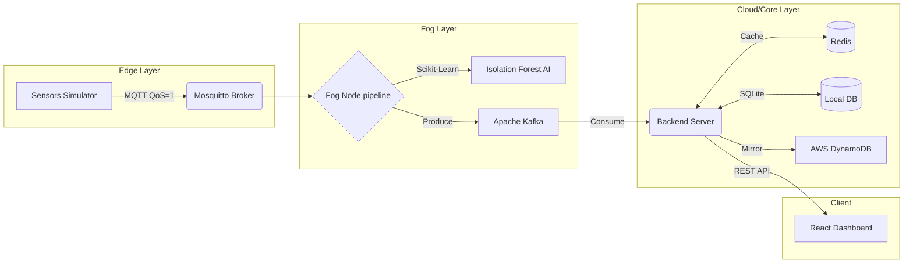

# EdgeGuardian: AIoT Fog Computing Monitor 🏭

[](https://www.docker.com/)
[](https://reactjs.org/)
[](https://kafka.apache.org/)
[](https://redis.io/)
[](https://aws.amazon.com/)

**Academic Project**: NCI H9FECC · Smart Industrial Monitoring  
**Objective**: To design, implement, and deploy a highly scalable, real-time Artificial Intelligence of Things (AIoT) pipeline leveraging Edge, Fog, and Cloud computing paradigms.

---

## 📖 Abstract

In modern industrial settings (Industry 4.0), heavy machinery generates immense volumes of sensor data every second. Sending raw, unfiltered data directly to the cloud results in extreme bandwidth costs, high latency, and processing bottlenecks. 

**EdgeGuardian** solves this by implementing a distributed **Fog Computing Architecture**. Data is ingested at the edge, pushed to a localized Fog Node via MQTT, where it is aggressively filtered, aggregated, and analyzed by an Unsupervised Machine Learning model (**Isolation Forest**). Only prioritized, highly-compressed insights (and critical anomalies) are forwarded to the Cloud (AWS DynamoDB) via an event-driven Apache Kafka and Redis pipeline.

---

## 🏗️ System Architecture

The project is strictly divided into three computational tiers:



### 1. The Edge Layer
- **Sensor Simulator**: A Python daemon generating highly realistic, high-frequency industrial data (Temperature, Vibration, Humidity, Pressure, Power).
- **MQTT Broker (Eclipse Mosquitto)**: Ensures low-latency, lightweight IoT messaging (QoS 1) from the sensors to the Fog Node.

### 2. The Fog Layer (The Core Innovation)
The Fog Node is a specialized microservice that intercepts the raw firehose of data and executes a **5-Stage Processing Pipeline**:
1. **Schema Validation**: Rejects malformed JSON payloads instantly.
2. **Noise Filtering**: Uses the Interquartile Range (IQR) method over a 20-reading sliding window to drop erroneous spikes.
3. **Time Aggregation**: Uses a 10-second tumbling window to convert raw arrays into compact statistical summaries (Mean, Min, Max, StdDev).
4. **Adaptive Sampling**: Dynamically adjusts processing windows based on the current anomaly rate.
5. **Prioritization & Dispatch**: Routes data into `CRITICAL`, `WARNING`, or `INFO` streams before publishing to Kafka.

#### 🤖 AI Anomaly Detection (Isolation Forest)
We utilize **Isolation Forest**, an unsupervised machine learning algorithm perfect for high-dimensional streaming data. Unlike standard thresholding, it isolates anomalies (like sudden, complex multi-sensor failures) in real-time without needing labeled training data.

### 3. The Cloud / Core Layer
- **Apache Kafka**: Acts as the immutable, high-throughput message bus, decoupling the Fog Node from the backend.
- **Node.js Backend**: Consumes the Kafka topics, caching real-time state in **Redis**, and persisting historical logs in **SQLite**.
- **AWS Integration**: The backend asynchronously mirrors processed insights to an **AWS API Gateway → Lambda → DynamoDB** pipeline for permanent cloud storage.
- **React Dashboard**: An ultra-premium, minimalist dashboard featuring real-time Recharts polling, live architecture SVG animations, and dynamic anomaly alerting.

---

## 🚀 How to Run Locally

The entire distributed system is containerized for deterministic execution.

1. **Clone the repository**
   ```bash
   git clone https://github.com/nandhakumar12/IoT-Streaming-FoG-and-Edge-.git
   cd IoT-Streaming-FoG-and-Edge-
   ```

2. **Spin up the architecture using Docker Compose**
   ```bash
   docker-compose up -d --build
   ```
   *(This launches 6 containers: Zookeeper, Kafka, Redis, Mosquitto, Backend, Dashboard, and Sensors)*

3. **Access the Dashboard**
   Open your browser and navigate to: `http://localhost:5173/`

---

## ☁️ Deployment (AWS EC2)

This architecture is optimized for cloud deployment. To deploy to an AWS EC2 instance (Ubuntu/Debian):

1. SSH into your EC2 instance.
2. Install Docker and Docker-Compose.
3. Pull the code and launch:
   ```bash
   git clone https://github.com/nandhakumar12/IoT-Streaming-FoG-and-Edge-.git
   cd IoT-Streaming-FoG-and-Edge-
   sudo docker-compose up -d --build
   ```
4. Expose port `5173` in your EC2 Security Group.
5. Access the live dashboard at `http://<EC2-PUBLIC-IP>:5173/`.

---
*Built with passion for modern distributed systems engineering.*
